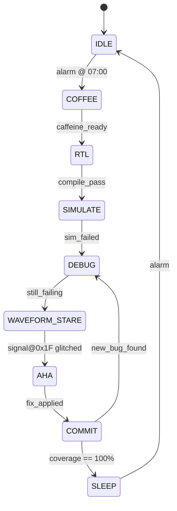

<div align="center">

<!-- Typing banner -->
<a href="https://github.com/AhmeDSaaDSweffI">
  
</a>

# `ahmed_sweffi.sv` — the human under test 🧪

**Digital IC Designer • Digital Verification Engineer**
📍 Cairo, Egypt &nbsp;|&nbsp; 🎓 E-JUST '27 &nbsp;|&nbsp; 🇯🇵→🇹🇼 Incoming Exchange @ NKUST

<a href="https://www.linkedin.com/in/ahmed-saad-sweffi-09b2751a9"></a>
<a href="mailto:a.s.sweffi@gmail.com"></a>
<a href="https://scholar.google.com/citations?user=sv31Gr0AAAAJ&hl=en"></a>
<a href="https://orcid.org/0009-0006-4340-9756"></a>
<a href="https://ieeexplore.ieee.org/author/756976241738184"></a>

</div>

---

## 🔩 The DUT (Device Under Test)

> Instantiate carefully. Requires an external caffeine PLL for stable operation.

```systemverilog
`timescale 1ns / 1_lifetime

module ahmed_sweffi #(
    parameter        LOCATION   = "Cairo, Egypt",
    parameter        ROLE       = "Digital IC Design & Verification",
    parameter int    COVERAGE   = 100          // %, non-negotiable
)(
    input  logic        clk,                    // sourced from a caffeine PLL
    input  logic        coffee_in,              // active-high, mandatory
    input  logic        deadline_near,          // async assert, unfortunately
    input  logic [7:0]  spec_ambiguity,         // there is always some
    output logic        clean_rtl,              // 0 lint violations
    output logic [31:0] bugs_found,             // monotonically increasing
    output logic        bugs_escaped            // tied to 1'b0 by contract
);

    // synthesizable charisma — passes DRC & LVS
    always_ff @(posedge clk or posedge deadline_near) begin
        if (coffee_in) begin
            clean_rtl  <= 1'b1;
            bugs_found <= bugs_found + 1'b1;
        end else begin
            clean_rtl  <= 1'bx;                  // do NOT drive without coffee
        end
    end

    assign bugs_escaped = 1'b0;                  // we simply don't do that here

endmodule
```

---

## 🔁 Daily FSM (state diagram)



```text
       __    __    __    __    __    __
clk  _|  |__|  |__|  |__|  |__|  |__|  |__     // ~running on caffeine
             _______
coffee_in __|       |___________________       // rising edge REQUIRED
                    ___________
clean_rtl _________|           |__________       // asserts shortly after coffee
```

---

## ✅ UVM Scoreboard Report

```text
============================================================================
  UVM_INFO scoreboard.sv(42) @ 27yrs: comparing expected vs ahmed_actual ...
----------------------------------------------------------------------------
  COVERGROUP                         COVERAGE   GOAL   STATUS
----------------------------------------------------------------------------
  verification_skills                 100.0%    100%   [ PASS ]
  rtl_design                           98.7%    100%   [ WARN ]  // always learning
  coffee_dependency                   100.0%    100%   [ PASS ]
  bugs_escaped_to_silicon               0.0%      0%   [ PASS ]
  imposter_syndrome                    42.0%      0%   [ FAIL ]  // known, WONTFIX
----------------------------------------------------------------------------
  UVM_INFO: ** TEST PASSED **   0 UVM_ERROR   0 UVM_FATAL
============================================================================
```

---

## 🧰 Tech Stack (`import ahmed_pkg::*;`)

**HDL & Methodologies**


**Protocols & Architecture**


**Programming & Tools**


---

## 🏗️ Featured `synthesis` (projects that actually taped out of my brain)

| Block | What it does | Coverage |
|---|---|---|
| 🧠 **NPU for Hybrid CNN-Transformer** (Grad Project, mentored by **Analog Devices**) | FPGA accelerator on Zynq-7020: 32×16 systolic PE array @ 76.8 GOPS, patch-reshape engine, SIMD post-processor, UVM block-level verification | in progress |
| 🔢 **Systolic Array** | Parameterizable weight-stationary array in SystemVerilog for CNN matmul | directed TB |
| 🔌 **I2C Design & Verify** | Master/Slave, all 4 modes, full UVM env | **100%** |
| 📡 **UART Transmitter** | FSM-based, configurable parity/baud, self-checking scoreboard | **100%** |
| 🧷 **SPI Slave + RAM** | Coverage-driven UVM, all SPI modes + memory ops | **100%** |
| 🚌 **AXI4-Lite Slave** | Layered UVM + SVA: handshaking, back-pressure, error responses | ✔ |
| 🧭 **Packet Router** | Constrained-random UVM: FIFO limits, port contention, bad headers | **100%** |
| 🗂️ **APB RAL** | UVM Register Abstraction Layer, mirroring checks | bit-field |
| ➕ **4-bit ALU** | Low-latency arith/logic + dynamic flags, transaction-level UVM | ✔ |
| 🚦 **Traffic Light FSM** | 4-way intersection on Altera Cyclone III, 7-seg driver | sim ✔ |
| ⚙️ **DSP48A1 Slice** | Configurable slice on Spartan-6, 100 MHz closure, 0 lint | **100%** |

---

## 📄 Publications

- **Sweffi, A. S.**, et al. *Spider IoT-Based Wearable Remote Health Monitoring System Using Machine Learning*, **JAC-ECC 2025**, Alexandria, Egypt. [`DOI: 10.1109/JAC-ECC67970.2025.11417567`](https://doi.org/10.1109/JAC-ECC67970.2025.11417567)
- 🕸️ *On progress* — **Spider IoT V2**: multi-modal sensing + optimized on-device ML.
- 🍅 *On progress* — **Tomato Plant Disease Detection**: real-time edge inference (YOLOv10 + MobileNetV2).

---

<div align="center">

## 📊 Post-Synthesis Reports


</div>

---

<div align="center">

```systemverilog
initial begin
    $display("Thanks for reading the testbench of my life.");
    $display("If bugs_escaped != 0, it was a feature.");
    $finish;
end
```

⭐ *Star a repo if the waveform made sense.*

</div>
