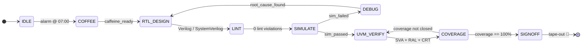

<div align="center">


<a href="https://www.linkedin.com/in/ahmed-saad-sweffi-09b2751a9"></a>
<a href="mailto:a.s.sweffi@gmail.com"></a>
<a href="https://scholar.google.com/citations?user=sv31Gr0AAAAJ&hl=en"></a>
<a href="https://ieeexplore.ieee.org/author/756976241738184"></a>

</div>

---

## 🔁 `module ahmed_sweffi` — state diagram

> Reset is optional. Coffee is not.



---

## 🗺️ Transition Legend — *(the skills firing on each edge)*

| State / Edge | Tools & skills in play |
|:--|:--|
| **RTL_DESIGN** | `Verilog` · `SystemVerilog` · HW/SW co-design |
| **LINT** | `Questa Lint` · `CDC/RDC` · STA · metastability |
| **SIMULATE** | `QuestaSim` · `ModelSim` · `Vivado` · `Quartus` |
| **UVM_VERIFY** | `UVM` · `SVA` · `RAL` · `Cocotb` · constrained-random |
| **COVERAGE** | functional + code coverage · GLS · signoff |
| **Protocols handled** | `AXI` · `AHB` · `APB` · `I2C` · `SPI` · `UART` · SerDes |
| **Also runs** | `Python` · `C/C++` · `MATLAB` · `TCL` · ML-for-HW |

```
UVM_INFO: state == SIGNOFF  →  coverage 100%,  0 bugs escaped to silicon.
```

<div align="center">

<sub>🎓 B.Sc. Electronics & Communications @ E-JUST · 🇹🇼 Incoming exchange @ NKUST · 📍 Cairo, Egypt</sub>

⭐ *Star the repo if the state machine reached SIGNOFF.*

</div>
